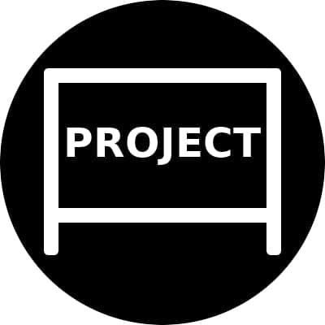

# PROJECTORING [](image.png) 


### :mortar_board: Сэкономит ваше время в организационых моментах.<br>  Таким образом,вы сможете уделить время самому главному - реализации проекта.


* :blush: **Projectoring** - это сервис для отслеживания прогресса
проекта, просмотра вклада каждого участника, обозначения
проблем, с которыми столкнулись участники проекта. 
***Основная идея*** - это помочь людям организовать свою 
проектную деятельность.<br>


  
## Структура проекта :feet:
```
.
├── logotip_project.jpg
├── manage.py
├── prodtoring
│   ├── admin.py
│   ├── apps.py
│   ├── __init__.py
│   ├── migrations
│   │   ├── 0001_initial.py
│   │   ├── 0002_person_project.py
│   │   └── __init__.py
│   ├── models.py
│   ├── static
│   │   ├── favicon.ico
│   │   └── favicon.png
│   ├── templates
│   │   ├── base.html
│   │   ├── index.html
│   │   ├── persons.html
│   │   └── project.html
│   ├── tests.py
│   └── views.py
├── projectoring
│   ├── asgi.py
│   ├── __init__.py
│   ├── settings.py
│   ├── urls.py
│   └── wsgi.py
├── README.md
└── requirements.txt

5 directories, 24 files
```

## :boom: Как получить:question: :
```shell script
git clone https://github.com/timofeev41/icthack2-lenmeni.git  
```
### Пользуйтесь нашим сервером, и тогда реальность будет соответствовать вашим ожиданиям :heart_eyes:

